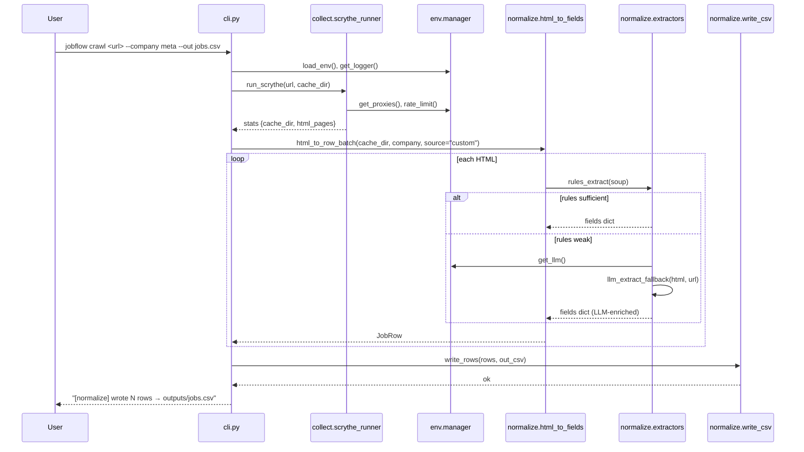
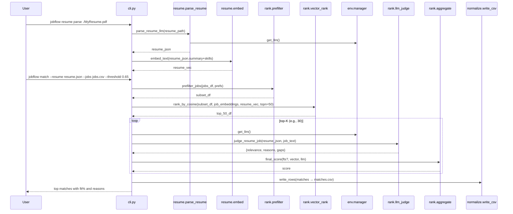

awesome — here’s a tight **UML “wiring map”** that shows how the **CLI** talks to **Scrythe**, your **LLM/env layer**, and the **normalization + matching** bits.

I kept it concrete: modules, key functions, and how data flows.

# System overview (components & data flow)

```mermaid
flowchart LR
    subgraph CLI
        C1[cli.py<br/>typer commands]
    end

    subgraph Collect
        SR[collect.scrythe_runner<br/>run_scrythe(), latest_cache()]
    end

    subgraph Normalize
        HF[normalize.html_to_fields<br/>html_to_row_batch(), parse_single_html()]
        EX[normalize.extractors<br/>rules_extract(), llm_extract_fallback()]
        SC[normalize.schema<br/>JobRow]
        WC[normalize.write_csv<br/>write_rows()]
    end

    subgraph Resume
        RP[resume.parse_resume<br/>parse_resume_llm()]
        EM[resume.embed<br/>embed_text()]
    end

    subgraph Rank
        PF[rank.prefilter<br/>prefilter_jobs()]
        VR[rank.vector_rank<br/>rank_by_cosine()]
        LJ[rank.llm_judge<br/>judge_resume_job()]
        AG[rank.aggregate<br/>final_score()]
    end

    subgraph Env/Config
        EN[env.manager<br/>load_env(), get_llm(), get_proxies()]
        LG[env.logging<br/>get_logger()]
    end

    C1 -->|crawl| SR --> HF --> WC
    C1 -->|gh/lever| WC
    HF --> EX
    EX -->|fallback| EN
    C1 -->|resume parse| RP --> EM
    C1 -->|match| PF --> VR --> LJ --> AG --> WC
    C1 --> EN
    SR --> EN
```

# Module relationships (class diagram style)

```mermaid
classDiagram
    class CLI {
      +gh(token, out)
      +lever(slug, out)
      +crawl(url, company, cache_root, out, normalize=true)
      +resume_parse(resume_path, out)
      +match(resume_json, jobs_csv, threshold, topk, out)
    }

    class ScrytheRunner {
      +run_scrythe(site_url, cache_dir, extra_args?) Dict
      +latest_cache(company_slug, base_cache) str?
    }

    class HtmlToFields {
      +html_to_row_batch(cache_path, company, source) List~JobRow~
      +parse_single_html(html, source_url, company, source) JobRow
      -clean_text(html) str
      -fingerprint(url, text) str
    }

    class Extractors {
      +rules_extract(soup) Dict
      +llm_extract_fallback(html, url) Dict
    }

    class Schema {
      <<dataclass>> JobRow
      +to_csv_row() List~Any~
      +JOB_HEADERS: List~str~
    }

    class WriteCSV {
      +write_rows(rows: List~JobRow~, out_csv: Path) None
    }

    class ResumeParse {
      +parse_resume_llm(path_or_text, prefs?) Dict
    }

    class Embed {
      +embed_text(text) Vector
    }

    class Prefilter {
      +prefilter_jobs(jobs_df, prefs) DataFrame
    }

    class VectorRank {
      +rank_by_cosine(jobs_df, job_embeddings, resume_vec, topn) DataFrame
    }

    class LlmJudge {
      +judge_resume_job(resume_json, job_text) Dict~{relevance, reasons, gaps}~
    }

    class Aggregate {
      +final_score(prefilter_s, vector_s, llm_s, weights) float
    }

    class EnvManager {
      +load_env(dotenv_path?) None
      +get_llm(provider?, model?) LLMClient
      +get_proxies() Dict
      +get_openai_key() str
      +rate_limit(key, tokens) contextmanager
    }

    class Logging {
      +get_logger(name) Logger
    }

    CLI --> ScrytheRunner
    CLI --> HtmlToFields
    HtmlToFields --> Extractors
    HtmlToFields --> Schema
    CLI --> WriteCSV
    CLI --> ResumeParse
    ResumeParse --> Embed
    CLI --> Prefilter
    Prefilter --> VectorRank
    VectorRank --> LlmJudge
    LlmJudge --> Aggregate
    CLI --> EnvManager
    Extractors --> EnvManager
    ScrytheRunner --> EnvManager
    CLI --> Logging
    ScrytheRunner --> Logging
```

# Crawl→Normalize sequence (Scrythe + LLM fallback path)



# Resume→Match sequence (filters → vectors → LLM judge)



# Function signatures (copy/paste starters)

```python
# env/manager.py
from contextlib import contextmanager
import os

def load_env(dotenv_path: str | None = None) -> None: ...
def get_openai_key() -> str: return os.getenv("OPENAI_API_KEY","")
def get_proxies() -> dict: ...
def get_llm(provider: str = "openai", model: str = "gpt-4o-mini") -> "LLMClient": ...
@contextmanager
def rate_limit(key: str, tokens: int = 1):
    # token bucket / sleep; yield control
    yield
```

```python
# collect/scrythe_runner.py
def run_scrythe(site_url: str, cache_dir: str, extra_args: list[str] | None = None) -> dict: ...
def latest_cache(company_slug: str, base_cache: str = ".cache") -> str | None: ...
```

```python
# normalize/extractors.py
from bs4 import BeautifulSoup

def rules_extract(soup: BeautifulSoup) -> dict:
    """Heuristics: title, location(s), pay, dept, type, dates, abs_url."""
    return {}

def llm_extract_fallback(html: str, url: str) -> dict:
    """LLM prompt → JSON fields when rules fail/noisy."""
    return {}
```

```python
# rank/llm_judge.py
def judge_resume_job(resume_json: dict, job_text: str, model: str = "gpt-4o-mini") -> dict:
    """Return {relevance: float 0..1, reasons: [..], must_have_gaps: [..]}."""
    return {}
```

# Why this setup works

* **Separation of concerns**: collecting vs normalizing vs matching are isolated; swapping Scrythe or adding a Playwright adapter doesn’t touch the rest.
* **Deterministic fallbacks**: rules first, LLM only when needed (faster, cheaper).
* **Env capsule**: single place for keys, proxies, rate limits, and LLM providers.
* **CLI-first**: everything is callable from commands; easy to automate.

If you want, I can drop these into files using your exact folder names so you can run `jobflow crawl` and `jobflow match` right away.
